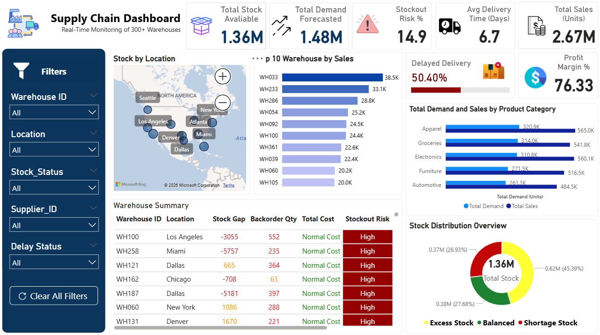

# Supply Chain Analytics & Optimization

## 📌 Project Overview

This project focuses on analyzing supply chain operations to identify inefficiencies in delivery performance, inventory management, operational costs, and resource allocation.

The analysis uses SQL, Python, Excel, and Power BI to transform raw supply chain data into actionable insights and optimization recommendations.

## 🎯 Business Problem

The organization was experiencing several supply chain challenges:

- Delayed deliveries
- Excess inventory in some warehouses
- Stock shortages in other warehouses
- High operational costs
- Inefficient resource allocation
- Reduced customer satisfaction

The objective was to analyze the available data and identify opportunities to improve overall supply chain efficiency.

## 🛠️ Tools & Technologies

- SQL
- Python
- Excel
- Power BI

## 🔎 Analysis Process

### 1. Data Cleaning

Cleaned and prepared the raw dataset using Excel to make it suitable for further analysis.

### 2. Exploratory Data Analysis

Used Python to explore the dataset, identify trends and patterns, and generate insights from the data.

### 3. SQL Analysis

Developed SQL queries to analyze supply chain KPIs, delivery performance, inventory levels, costs, sales performance, and operational efficiency.

### 4. Power BI Dashboard

Created an interactive Power BI dashboard to visualize key supply chain metrics and support data-driven decision-making.



## 📊 Key Results

The analysis identified supply chain optimization opportunities with the following potential impact:

- **15% potential improvement** in on-time delivery rate
- **$1.37M potential reduction** in total costs
- Potential reduction in excess inventory and stock shortages
- Profit margin could improve from **75.30% to 76.33%**
- Identified opportunities for employee reallocation based on sales performance and operational efficiency

## 💡 Key Insights

The analysis helped identify:

- Areas contributing to delivery delays
- Inventory imbalances across warehouses
- Cost optimization opportunities
- Differences in warehouse and sales performance
- Opportunities to improve employee allocation

## 📈 Dashboard

The Power BI dashboard provides an interactive view of supply chain performance, including delivery, inventory, cost, sales, and operational KPIs.

## 📁 Project Structure

```text
Dataset/
Excel_Data_Cleaning/
Python_EDA/
SQL_Queries/
PowerBI_Dashboard/
Presentation/
README.md
